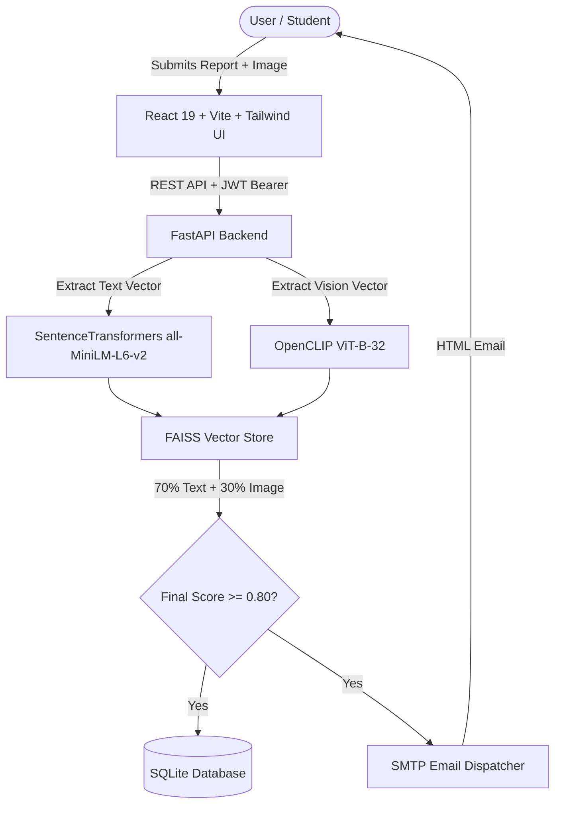

# AI Lost & Found Assistant

[](https://opensource.org/licenses/MIT)
[](https://fastapi.tiangolo.com/)
[](https://react.dev/)
[](https://tailwindcss.com/)
[](https://github.com/facebookresearch/faiss)

A production-ready full-stack AI web application designed to help colleges, universities, and organizations report lost & found items and automatically pair matching records using multimodal Artificial Intelligence (**SentenceTransformers** text embeddings + **OpenCLIP** vision embeddings + **FAISS** vector search).

---

## 🌟 Key Features

- 🔒 **Secure Authentication**: JWT Access Tokens, `bcrypt` password hashing, protected routes, and role-based access control (User & Admin).
- 📦 **Lost & Found Reporting**: Submit item details, date, category, precise location, and upload item photos ($\le$ 5MB).
- 🧠 **Multimodal AI Engine**:
  - **Text Embeddings**: `SentenceTransformer("all-MiniLM-L6-v2")` generating 384-dimensional semantic text vectors.
  - **Image Embeddings**: `OpenCLIP` generating 512-dimensional normalized visual feature vectors.
  - **FAISS Vector Search**: Instant cosine similarity search.
  - **Formula**: $\text{Final Score} = 0.70 \times \text{Text Similarity} + 0.30 \times \text{Image Similarity}$.
- 📧 **Automated Email Notifications**: Automatically sends responsive HTML emails via SMTP (Gmail compatible) when a match score $\ge 80\%$.
- 📊 **Interactive Dashboard**:
  - Filter lost/found items, review high-confidence AI match pairings side-by-side, mark items as claimed.
  - Real-time in-app notification center.
- 🛡️ **Admin Panel**: Audit registered users, moderate lost/found reports, delete spam, and monitor AI confidence distributions.

---

## 🏗️ Architecture Overview



---

## 🚀 Quick Start Guide

### Prerequisites
- **Python**: 3.10 or higher
- **Node.js**: v18.0.0 or higher & `npm`

---

### 1. Backend Setup

```bash
# Navigate to backend directory
cd backend

# Create virtual environment
python -m venv venv

# Activate virtual environment (Windows)
venv\Scripts\activate
# (On macOS/Linux: source venv/bin/activate)

# Install backend dependencies
pip install -r requirements.txt

# Create .env file from .env.example
copy .env.example .env

# Run FastAPI dev server
python -m uvicorn app.main:app --reload --host 0.0.0.0 --port 8000
```

The FastAPI backend will run at `http://localhost:8000`. 
Swagger API Docs will be available at `http://localhost:8000/docs`.

---

### 2. Frontend Setup

```bash
# Open a new terminal and navigate to frontend directory
cd frontend

# Install dependencies
npm install

# Start Vite development server
npm run dev
```

The React app will launch at `http://localhost:3000`.

---

## 🔑 Default Credentials

The database automatically seeds demo accounts on first launch:

| Account Type | Email | Password | Role |
| :--- | :--- | :--- | :--- |
| **Default Admin** | `admin@campus.edu` | `admin123` | Administrator |
| **Demo Student** | `student@campus.edu` | `student123` | Standard User |

---

## 📡 REST API Reference Summary

| Method | Endpoint | Description |
| :--- | :--- | :--- |
| `POST` | `/register` | Register new user account |
| `POST` | `/login` | Log in and receive JWT access token |
| `GET` | `/profile` | Get current user profile details |
| `POST` | `/lost` | Create lost item report + trigger AI search |
| `GET` | `/lost` | Retrieve list of lost item reports |
| `POST` | `/found` | Create found item report + trigger AI search |
| `GET` | `/found` | Retrieve list of found item reports |
| `POST` | `/match` | Manually run full AI vector match scan |
| `GET` | `/matches` | Get AI match pairs ($\ge 80\%$) |
| `PUT` | `/matches/{id}/status` | Confirm ownership or reject match pairing |
| `GET` | `/notifications` | Get user notifications history |
| `GET` | `/admin/stats` | View system match stats & AI metrics |
| `DELETE` | `/admin/report/{type}/{id}` | Delete spam/fake item report |

---

## ⚙️ Environment Variables (`.env`)

```ini
APP_NAME=AI Lost & Found Assistant
DEBUG=True
SECRET_KEY=supersecretjwtkey_change_in_production_123456789
DATABASE_URL=sqlite:///./lost_and_found.db
UPLOAD_DIR=uploads

MATCH_THRESHOLD=0.80
TEXT_WEIGHT=0.70
IMAGE_WEIGHT=0.30

# SMTP Email Configuration (Gmail App Password)
SMTP_HOST=smtp.gmail.com
SMTP_PORT=587
SMTP_USER=your_email@gmail.com
SMTP_PASSWORD=your_app_password
EMAIL_ENABLED=False
```

---

## 📜 License

This project is open-source and available under the [MIT License](LICENSE).
